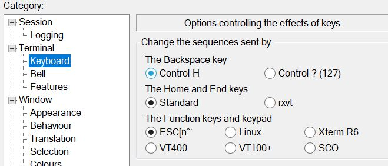
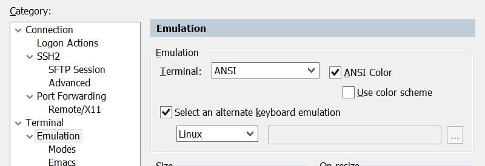

ntw-menu
============================================================
Network Menu (ANSI Terminal) - python3

Demo:

ntw-menu uses a modifed version of Termenu which you can find at https://github.com/elifiner/termenu

Features
---------------------------------
* SSH, TELNET, FTP, SFTP protocol support
* Manually editable CSV data file
* Multiple menu session types:
    * Protocol submenu
    * Pre-set protocol (default tcp port)
	* Pre-set protocol and custom tcp port
* Full regex search to filter through device names, IPs, protocols and ports
* Per-user search and selection memory across multiple sessions
* Script to import device session data via Solarwinds API
* Customisable settings via config file

Download ntw-menu from git
---------------------------------

	sudo git clone https://github.com/rdeangel/ntw-menu ntw-menu
	
or

	download https://github.com/rdeangel/ntw-menu/archive/master.zip

Install required python libraries
---------------------------------

Depending on the python distribution you have on your system make sure you install all needed python libraries:

You will probably need to install the following:

	pip3 install numpy
	pip3 install configparser
	pip3 install pyfiglet
	pip3 install orionsdk

...maybe more or less packages installation are required depending on your installation of python3

config.ini
---------------------------------

Use config.ini to configure ntw-menu settings.

The following parameters are used by ntw-menu.py:

	[MENU_PARAMETERS]
	Banner
	Min_Term_Width
	Min_Term_Height
	Back_To_Menu_Timer
	Connection_Timeout
	
	[SESSION_MEMORY_PARAMETERS]
	User_Memory
	User_Selection_Memory
	
	[DATA_PARAMETERS]
	Static_Device_List_File
	Import_Device_List_File

while the following parameters are used by ntw-menu_solarwinds_import.py:

	[DATA_PARAMETERS]
	Import_Device_List_File = 

	[SOLARWINDS_PARAMETERS]
	SW_Host
	SW_Username
	SW_Password

	[EMAIL_PARAMETERS]
	EnableEmailNotification
	EmailOnImport
	EmailOnFailure
	EmailServer
	AdminEmailSenderName
	AdminEmailSenderAddress
	AdminEmailReceiverName
	AdminEmailReceiverAddress
	AdminEmailSubject

	
Keyboard usage
---------------------------------
	ALPHANUMERIC + SYMBOL KEYs = use to filter device list
	ENTER = Select a menu option and move to the next menu/input
	ESC = Move to previous menu or reset filter
	CTRL-B = Scroll Up
	CTRL-F = Scroll Down
	CTRL-E = exit
	CTRL-C = forced exit

NOTE: Make sure your ssh client is using ANSI terminal emulation.

Terminal clients support (change default settings)
---------------------------------
Windows Terminal clients specific setting:

Putty:

SecureCRT:

JuiceSSH (Android client):
Backspace: Legacy (sends ^H)

Termius (Android client):
Delete sends Ctrl-H

Toggle session search and selection memory (persistence)
---------------------------------

Disable (useful when used in a shared account):
touch ~/.ntw-menu/no_mem

Enable (enabled by default):
rm ~/.ntw-menu/no_mem

Device list import scheduling
---------------------------------

If you are importing a device list dinamically from solarwinds, a cronjob should be created to run ntw-menu_solarwinds_import.py

	ntw-menu_solarwinds_import.py .*
