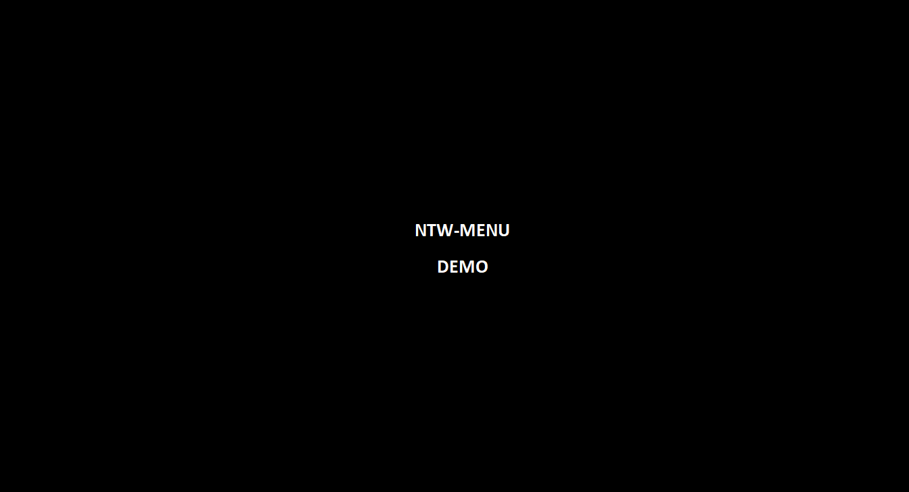

ntw-menu
============================================================
Network Menu - python3

Demo:

ntw-menu uses a modifed version of Termenu which you can find at https://github.com/elifiner/termenu

Download ntw-menu from git
---------------------------------

	sudo git clone https://github.com/rdeangel/ntw-menu ntw-menu
	
or

	download https://github.com/rdeangel/ntw-menu/archive/master.zip

config.ini
---------------------------------

Use config.ini to configure ntw-menu settings.

The following parameters are used by ntw-menu.py:

	[MENU_PARAMETERS]
	Banner
	Min_Term_Width
	Min_Term_Height
	Back_To_Menu_Timer
	Connection_Timeout
	
	[SESSION_MEMORY_PARAMETERS]
	User_Memory
	User_Selection_Memory
	
	[DATA_PARAMETERS]
	Static_Device_List_File
	Import_Device_List_File

while the following parameters are used by ntw-menu_solarwinds_import.py:

	[DATA_PARAMETERS]
	Import_Device_List_File = 

	[SOLARWINDS_PARAMETERS]
	SW_Host
	SW_Username
	SW_Password

	[EMAIL_PARAMETERS]
	EnableEmailNotification
	EmailOnImport
	EmailOnFailure
	EmailServer
	AdminEmailSenderName
	AdminEmailSenderAddress
	AdminEmailReceiverName
	AdminEmailReceiverAddress
	AdminEmailSubject

Install required python libraries
---------------------------------

Depending on the python distribution you have on your system make sure you install all needed python libraries:

You will probably need to install the following:

	pip3 install numpy
	pip3 install configparser
	pip3 install pyfiglet
	pip3 install orionsdk

...maybe more or less packages installation are required depending on your installation of python3

Device list import scheduling
---------------------------------

If you are importing a device list dinamically from solarwinds, a cronjob should be created to run ntw-menu_solarwinds_import.py

	ntw-menu_solarwinds_import.py .*

